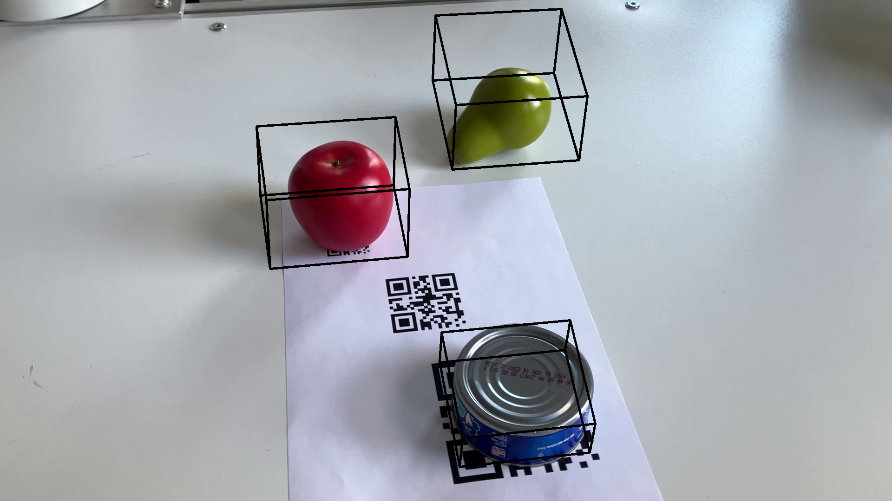

# Hololens 2 labeling base 

--- 
## Overview
These tools are used to receive and save data from the Hololens 2,
the working application can be found under 

https://github.com/intuitive-robots/human-demonstration-ar/tree/labeling

## Structure

```
    _
    |- calibration         # after a camera calibration the result will be stored here 
    |- calibration-frames  # Only the images put here will be used by calibration.py
    |- doc                 # documentation 
    |- imgs                # single frames from video2label.py will be safed here 
    |- saves               # Uploaded data from the hololens will be put here
    |- videos              # videos to test can be stored here
```
